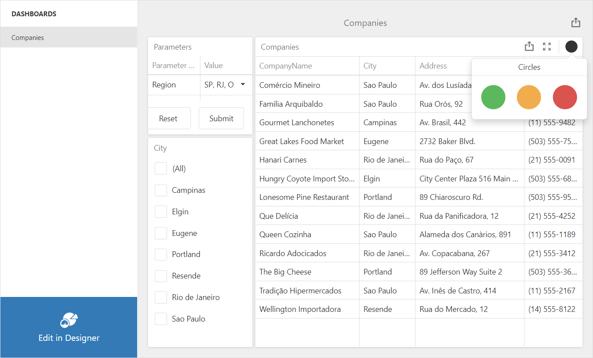

<!-- default badges list -->

<!-- default badges end -->

# Dashboard for Blazor WebAssembly - JavaScript Customization

This example shows how you can customize the `DxDashboard` component with JavaScript:

- The [DxJSCustomization](https://docs.devexpress.com/Dashboard/DevExpress.DashboardBlazor.DxJSCustomization?v=21.1) class provides access to the [DashboardControl](https://docs.devexpress.com/Dashboard/js-DevExpress.Dashboard.DashboardControl) event handlers.
- The [onBeforeRender](https://docs.devexpress.com/Dashboard/js-DevExpress.Dashboard.DashboardControlOptions#js_devexpress_dashboard_dashboardcontroloptions_onbeforerender) event handler registers the [Dashboard Panel](https://docs.devexpress.com/Dashboard/119771/web-dashboard/ui-elements-and-customization/ui-elements/dashboard-panel?p=netframework) and custom [Parameter](https://github.com/DevExpress/dashboard-extensions/blob/master/docs/parameter-item.md) extensions. The event handler also removes the "New..." item from the dashboard menu.
- The [onItemCaptionToolbarUpdated](https://docs.devexpress.com/Dashboard/js-DevExpress.Dashboard.ViewerApiExtensionOptions#js_devexpress_dashboard_viewerapiextensionoptions_onitemcaptiontoolbarupdated) event handler adds a custom toolbar item to the Grid's caption.

## Files to Look At

* [Dashboard.razor](./CS/BlazorDashboardApp.Client/Pages/Dashboard.razor)
* [index.html](./CS/BlazorDashboardApp.Client/wwwroot/index.html)
* [dashboard-events-scripts.js](./CS/BlazorDashboardApp.Client/wwwroot/dashboard-events-scripts.js)
* [parameter-item.js](./CS/BlazorDashboardApp/BlazorDashboardApp.Client/wwwroot/parameter-item.js)

## Documentation

- [DxJSCustomization](https://docs.devexpress.com/Dashboard/DevExpress.DashboardBlazor.DxJSCustomization?v=21.1)
- [Create a Blazor WebAssembly Dashboard Application](https://docs.devexpress.com/Dashboard/401892?v=21.1)

## More Examples

- [Get Started - Dashboard Component in Blazor WebAssembly Application](https://github.com/DevExpress-Examples/dashboard-blazor-webassembly-app)
- [Dashboard Blazor WebAssembly App - Configuration](https://github.com/DevExpress-Examples/dashboard-blazor-webassembly-configuration)
- [Dashboard Blazor Server App - JavaScript Customization](https://github.com/DevExpress-Examples/dashboard-blazor-server-js-customization)
